# 20 Case Study Xây Dựng Ứng Dụng iOS

> Tài liệu bổ trợ cho khóa học. Mỗi **bài** mổ xẻ **một ứng dụng thật**, gói trong **tối đa 3 slide**:
> **Slide 1 — Tổng quan** (lĩnh vực, ý tưởng, mô hình kinh doanh, yếu tố then chốt) ·
> **Slide 2 — Khái niệm & thuật ngữ kỹ thuật** (framework, kỹ thuật, từ khóa) ·
> **Slide 3 — Sơ đồ kiến trúc & bài học rút ra**.
>
> Mục tiêu: 20 ứng dụng phủ hết các khía cạnh **kỹ thuật · kinh doanh · lĩnh vực (domain)** mà bạn sẽ gặp khi làm app iOS thật.

---

## Bản đồ bao phủ

| # | Loại ứng dụng | Bài học kỹ thuật chính | Mô hình kinh doanh | Lĩnh vực |
|---|---|---|---|---|
| 1 | AI Photo Editor | Core Image / Metal / Core ML | Subscription | Công cụ sáng tạo |
| 2 | Habit & Fitness Tracker | HealthKit + WidgetKit | Freemium | Sức khỏe |
| 3 | Personal Finance | Keychain, mã hóa, bank API | Freemium + premium | Fintech |
| 4 | Social Photo Feed | Backend quy mô lớn, feed ranking, CDN | Quảng cáo | Mạng xã hội |
| 5 | Meditation / Sleep | Background audio, streaming | Content subscription | Wellness |
| 6 | Food Delivery | Theo dõi thời gian thực, MapKit | Hoa hồng sàn | Logistics |
| 7 | Casual Game | SpriteKit/Unity, game loop | IAP + quảng cáo | Game |
| 8 | E-commerce | Apple Pay, giỏ hàng, analytics | Giao dịch | Bán lẻ |
| 9 | Notes / Productivity | CloudKit sync, offline-first | Mua 1 lần + subscription | Năng suất |
| 10 | Language Learning | Spaced repetition, gamification | Freemium | EdTech |
| 11 | Ride-Hailing | Live location, ghép cặp 2 chiều | Hoa hồng | Di chuyển |
| 12 | Music Streaming | DRM, tải offline, bản quyền | Subscription | Media |
| 13 | Dating | Matching, trust & safety | Subscription + microtxn | Mạng xã hội |
| 14 | News / Reading | Paywall, push, pipeline nội dung | Subscription + ads | Báo chí |
| 15 | AR Furniture/Measure | ARKit / RealityKit, 3D | Lead-gen / bán lẻ | AR commerce |
| 16 | Smart-Home Companion | BLE / HomeKit, ghép thiết bị | Phần cứng + app | IoT |
| 17 | Kids Education | COPPA, parental gate | Family subscription | Kids EdTech |
| 18 | Enterprise Field App | MDM, offline sync, bảo mật | B2B SaaS theo seat | Doanh nghiệp |
| 19 | Short-Video Editor | AVFoundation, export pipeline | Creator subscription | Creator economy |
| 20 | AI Chat Assistant | LLM API, streaming, chi phí token | Theo lượt dùng / subscription | AI |

---

## Bài CS-1 — AI Photo Editor (kiểu SnapEdit)

### Slide 1 · Tổng quan
- **Lĩnh vực:** công cụ sáng tạo ảnh — xóa vật thể, làm nét, upscale, đổi nền.
- **Ý tưởng:** biến thao tác chỉnh ảnh phức tạp thành 1–2 chạm, nhờ AI.
- **Mô hình kinh doanh:** subscription (tuần/năm), bản free có **watermark**; **paywall onboarding** là đòn bẩy chuyển đổi số 1.
- **Yếu tố then chốt:** chất lượng ảnh xuất ra, tốc độ xử lý, chi phí GPU server.

### Slide 2 · Khái niệm & thuật ngữ
- **Core Image / Metal:** pipeline lọc ảnh real-time trên GPU.
- **Core ML / Vision:** model trên thiết bị (segmentation, super-resolution).
- **On-device vs Server:** đánh đổi *độ trễ ↔ chi phí ↔ riêng tư* cho từng tính năng.
- **Tiling & downsampling:** ảnh 48MP dễ vượt giới hạn RAM → chia ô, xem trước ở độ phân giải thấp, chỉ xử lý full-res khi **export**.
- **StoreKit 2:** quản lý subscription, restore, trạng thái entitlement.

### Slide 3 · Kiến trúc & bài học
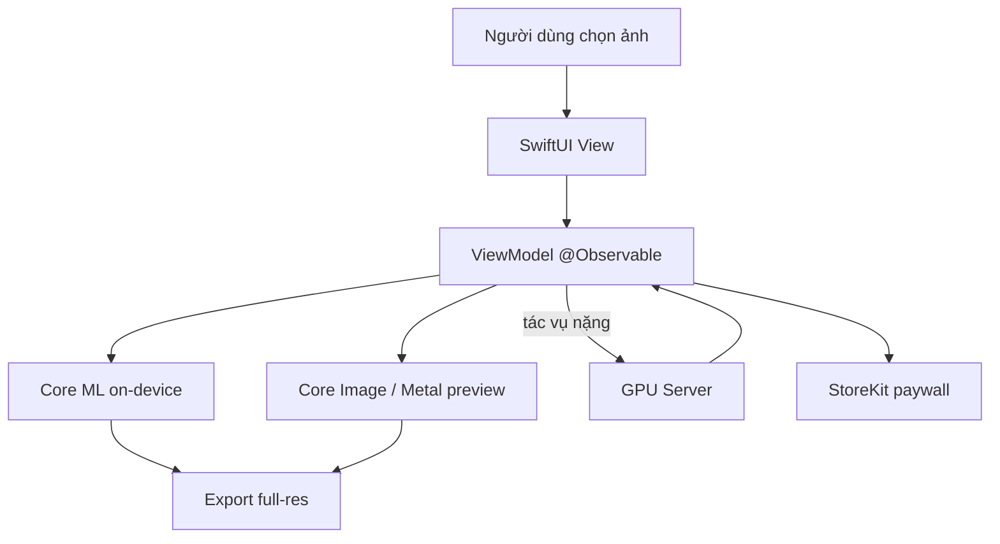
- **Bài học:** quyết định *on-device vs server* theo từng tính năng. Cache mạnh tay. Bước **export/share** là nơi người dùng đánh giá chất lượng — đầu tư vào đó.

---

## Bài CS-2 — Habit & Fitness Tracker

### Slide 1 · Tổng quan
- **Lĩnh vực:** sức khỏe — bước chân, bài tập, chuỗi (streak).
- **Ý tưởng:** biến vận động thành thói quen nhờ vòng tròn tiến độ & nhắc nhở.
- **Mô hình:** freemium — theo dõi miễn phí, trả phí cho lịch sử/thống kê nâng cao.
- **Yếu tố then chốt:** giữ chân hằng ngày (retention) > số lượng tính năng.

### Slide 2 · Khái niệm & thuật ngữ
- **HealthKit:** đọc/ghi dữ liệu sức khỏe; quyền là **all-or-nothing** theo từng loại và **im lặng khi bị từ chối**.
- **WidgetKit:** vòng tròn ngoài màn hình chính.
- **Live Activities / ActivityKit:** hiển thị buổi tập đang diễn ra trên Lock Screen / Dynamic Island.
- **Background delivery:** cập nhật bước chân thụ động.
- **HealthKit authorization UX:** thiết kế cho trường hợp **thiếu dữ liệu**.

### Slide 3 · Kiến trúc & bài học
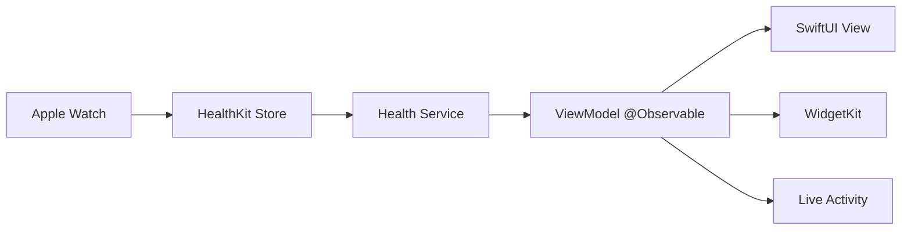
- **Bài học:** quyền sức khỏe im lặng khi bị từ chối — luôn thiết kế cho dữ liệu thiếu. **Widget + Apple Watch** thúc đẩy giữ chân mạnh hơn tính năng.

---

## Bài CS-3 — Personal Finance / Budgeting

### Slide 1 · Tổng quan
- **Lĩnh vực:** fintech — tài khoản, giao dịch, ngân sách.
- **Ý tưởng:** gom mọi tài khoản về một chỗ, tự phân loại chi tiêu.
- **Mô hình:** freemium + premium (đa tài khoản, dự báo) hoặc B2B2C white-label.
- **Yếu tố then chốt:** **niềm tin** — một sự cố rò rỉ là kết thúc.

### Slide 2 · Khái niệm & thuật ngữ
- **Aggregation (Plaid/Open Banking):** kết nối dữ liệu ngân hàng.
- **Keychain:** lưu token bảo mật.
- **LocalAuthentication:** cổng sinh trắc học (Face ID / Touch ID).
- **Certificate pinning:** chống tấn công trung gian.
- **Quy định (PSD2, data residency):** định hình kiến trúc.

### Slide 3 · Kiến trúc & bài học
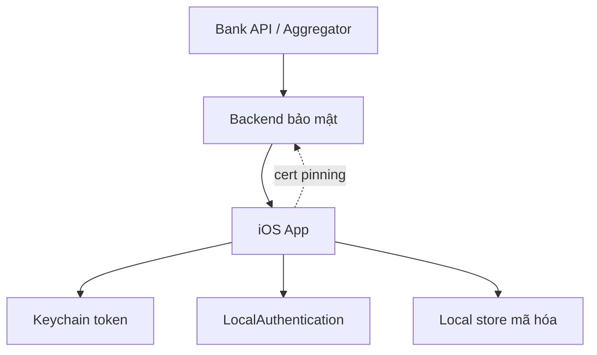
- **Bài học:** bảo mật chính là sản phẩm. App Review soi rất kỹ app tài chính. Bề mặt pháp lý định hình kiến trúc ngay từ đầu.

---

## Bài CS-4 — Social Photo Feed

### Slide 1 · Tổng quan
- **Lĩnh vực:** mạng xã hội.
- **Ý tưởng:** chia sẻ ảnh, theo dõi, tương tác.
- **Mô hình:** quảng cáo — cần **quy mô** trước khi có doanh thu.
- **Yếu tố then chốt:** rủi ro sống còn là **cold-start** (mạng lưới rỗng).

### Slide 2 · Khái niệm & thuật ngữ
- **Feed ranking:** thuật toán sắp xếp dòng tin.
- **Fan-out on write vs read:** chiến lược phát tán bài đăng.
- **CDN + image cache:** phục vụ ảnh nhanh, prefetch khi cuộn.
- **Optimistic UI:** cập nhật "like" ngay, đồng bộ sau.
- **Moderation:** bắt buộc, không phải tùy chọn.

### Slide 3 · Kiến trúc & bài học
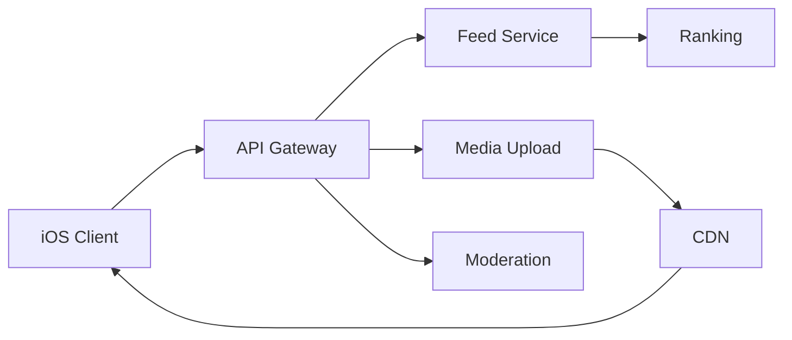
- **Bài học:** app mạng xã hội là **bài toán hệ phân tán** khoác áo UI. Phần khó nằm ở backend, không phải client.

---

## Bài CS-5 — Meditation / Sleep

### Slide 1 · Tổng quan
- **Lĩnh vực:** wellness — audio dẫn thiền, âm thanh ru ngủ.
- **Ý tưởng:** thư giãn theo phiên, kèm hẹn giờ ngủ.
- **Mô hình:** content subscription — giá trị = quy mô thư viện + nhịp ra nội dung mới.
- **Yếu tố then chốt:** đây thực chất là **bài toán nội dung**, chi phí sản xuất/bản quyền chiếm ưu thế.

### Slide 2 · Khái niệm & thuật ngữ
- **AVAudioSession:** cấu hình phát nền + mixing.
- **MPNowPlayingInfoCenter / MPRemoteCommandCenter:** điều khiển trên Lock Screen.
- **Streaming + offline download:** nghe khi không mạng.
- **Sleep timer:** chạy bền khi app vào nền.
- **Background Modes (audio):** capability bắt buộc.

### Slide 3 · Kiến trúc & bài học
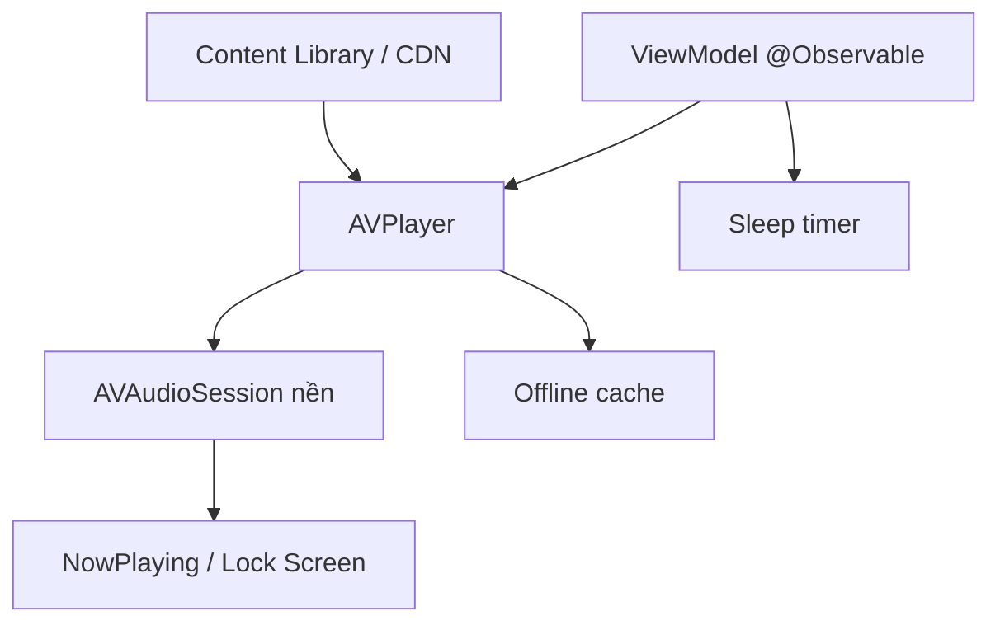
- **Bài học:** cấu hình background audio rườm rà nhưng quyết định thành bại — nhạc **không được tắt khi khóa máy**.

---

## Bài CS-6 — Food Delivery

### Slide 1 · Tổng quan
- **Lĩnh vực:** logistics — sàn 3 bên (khách · quán · tài xế).
- **Ý tưởng:** đặt món, theo dõi tài xế thời gian thực.
- **Mô hình:** hoa hồng mỗi đơn + phí giao; biên lợi nhuận khắc nghiệt.
- **Yếu tố then chốt:** thường là **3 app riêng** (khách, quán, tài xế).

### Slide 2 · Khái niệm & thuật ngữ
- **Order state machine:** máy trạng thái đơn hàng.
- **Live tracking trên MapKit:** vẽ vị trí tài xế theo thời gian thực.
- **Push theo từng giai đoạn:** đã nhận → đang nấu → đang giao.
- **Payment + tipping:** thanh toán, tip.
- **WebSocket / realtime channel:** cập nhật vị trí.

### Slide 3 · Kiến trúc & bài học
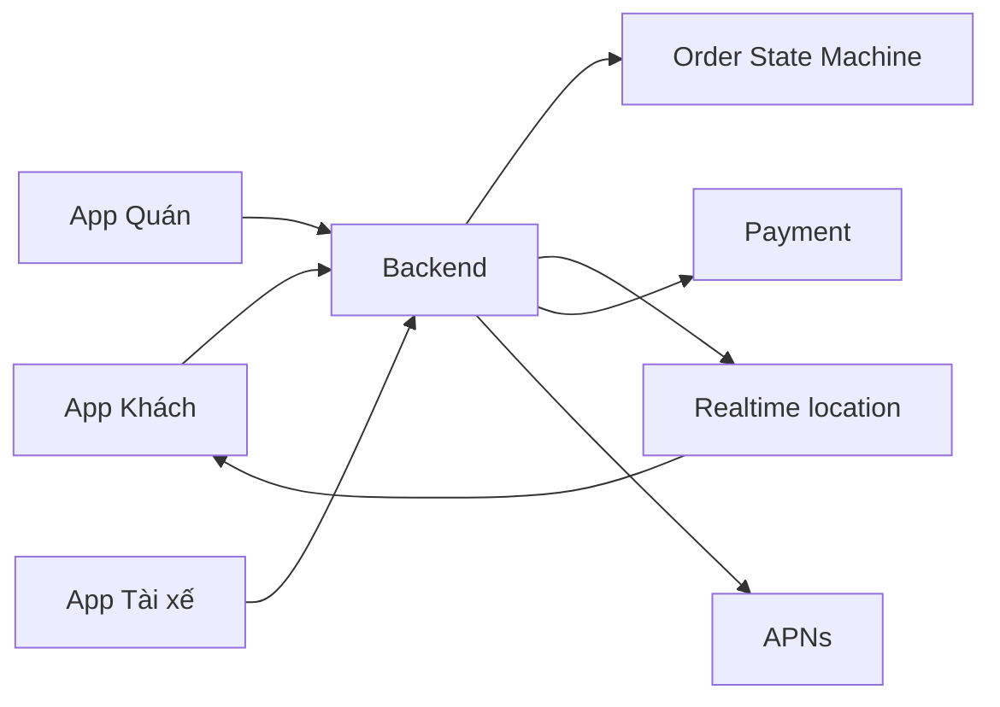
- **Bài học:** bản đồ "đồ ăn của tôi đâu" là UX cảm xúc. Realtime + payment + maps = vận hành phức tạp; bạn đang xây một công ty logistics.

---

## Bài CS-7 — Casual Mobile Game

### Slide 1 · Tổng quan
- **Lĩnh vực:** game.
- **Ý tưởng:** chơi nhanh, dễ học, khó bỏ.
- **Mô hình:** free + IAP (vật phẩm tiêu hao, gỡ quảng cáo) + rewarded video; **live-ops** kéo doanh thu.
- **Yếu tố then chốt:** retention (D1/D7/D30) & ARPDAU là tất cả.

### Slide 2 · Khái niệm & thuật ngữ
- **SpriteKit / SceneKit / Unity:** engine dựng game.
- **Game loop (fixed timestep):** vòng lặp cập nhật–vẽ.
- **Texture atlas:** gom asset để tối ưu vẽ.
- **GameKit:** bảng xếp hạng, thành tựu.
- **StoreKit edge cases:** restore, refund, hoàn tiền.

### Slide 3 · Kiến trúc & bài học
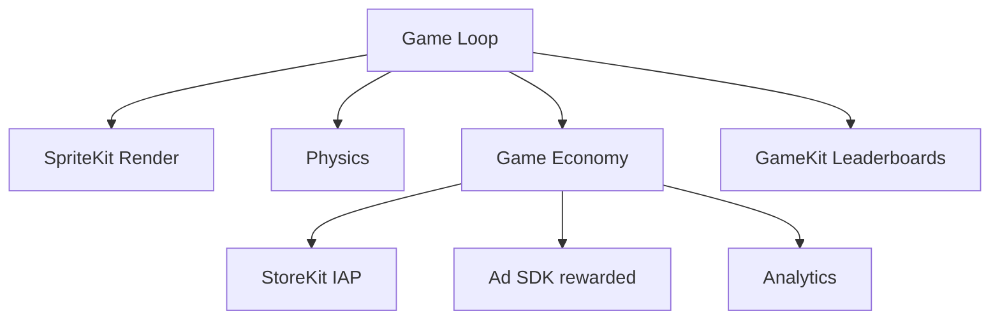
- **Bài học:** chỉ chỉ số retention & doanh thu mỗi người dùng quan trọng. Cân bằng kinh tế trong game là việc **liên tục**.

---

## Bài CS-8 — E-commerce / Retail

### Slide 1 · Tổng quan
- **Lĩnh vực:** bán lẻ.
- **Ý tưởng:** duyệt sản phẩm, bỏ giỏ, thanh toán nhanh.
- **Mô hình:** giao dịch (hàng vật lý → **không** mất 30% của Apple → app có thể miễn phí).
- **Yếu tố then chốt:** hiệu năng lưới sản phẩm/ảnh = doanh thu.

### Slide 2 · Khái niệm & thuật ngữ
- **Apple Pay (PassKit):** chuyển đổi cao hơn nhiều so với nhập thẻ tay.
- **Cart / checkout funnel:** phễu mua hàng.
- **Deep links:** dẫn thẳng tới sản phẩm.
- **Abandoned-cart push:** nhắc giỏ hàng bỏ quên.
- **Analytics funnel:** đo từng bước rơi rớt.

### Slide 3 · Kiến trúc & bài học
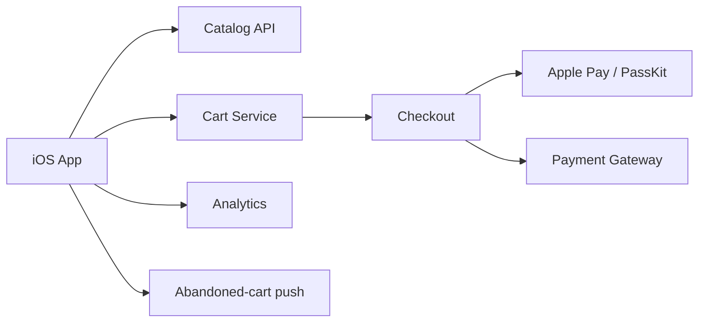
- **Bài học:** Apple Pay là "siêu năng lực" chuyển đổi — làm cho chuẩn. Tồn kho/auth/đổi trả nằm ở server.

---

## Bài CS-9 — Notes / Productivity (offline-first)

### Slide 1 · Tổng quan
- **Lĩnh vực:** năng suất.
- **Ý tưởng:** ghi chú nhanh, đồng bộ mọi thiết bị.
- **Mô hình:** mua 1 lần hoặc subscription cho sync/teams.
- **Yếu tố then chốt:** **đồng bộ offline-first** là toàn bộ cuộc chơi.

### Slide 2 · Khái niệm & thuật ngữ
- **CloudKit:** hạ tầng đồng bộ của Apple (gắn với hệ sinh thái).
- **Local source of truth (SwiftData):** dữ liệu cục bộ là gốc.
- **Conflict resolution:** last-write-wins vs **CRDT**.
- **Full-text search:** tìm kiếm nhanh.
- **Cold launch:** khởi động tức thì.

### Slide 3 · Kiến trúc & bài học
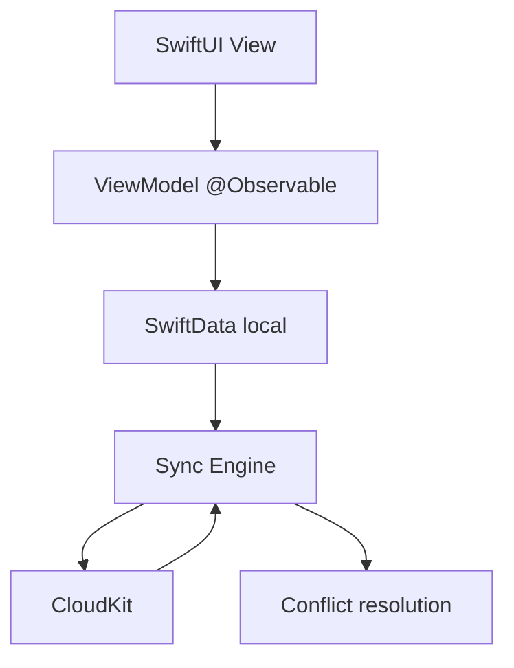
- **Bài học:** xung đột đồng bộ là nơi app sống hay chết. **Chọn mô hình giải quyết xung đột trước tiên.**

---

## Bài CS-10 — Language Learning

### Slide 1 · Tổng quan
- **Lĩnh vực:** EdTech.
- **Ý tưởng:** học ngôn ngữ qua bài ngắn, có thưởng.
- **Mô hình:** freemium — premium gỡ ma sát (tim/hearts, offline, không quảng cáo).
- **Yếu tố then chốt:** **gamification chính là động cơ giữ chân**.

### Slide 2 · Khái niệm & thuật ngữ
- **Spaced repetition (SM-2 / FSRS):** lịch ôn theo trí nhớ.
- **Speech framework:** nhận diện phát âm.
- **Gamification:** streak, XP, hearts.
- **A/B testing infra:** văn hóa thử nghiệm dày đặc.
- **Instrumentation:** đo lường từ đầu tới cuối.

### Slide 3 · Kiến trúc & bài học
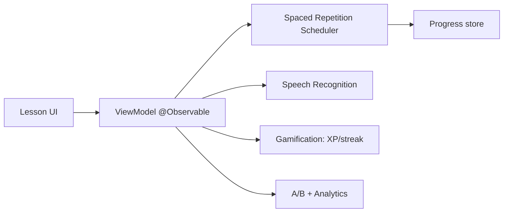
- **Bài học:** gamification giữ chân mạnh hơn nội dung. Văn hóa thử nghiệm khổng lồ — app phải được đo lường toàn diện.

---

## Bài CS-11 — Ride-Hailing

### Slide 1 · Tổng quan
- **Lĩnh vực:** di chuyển — sàn 2 chiều thời gian thực.
- **Ý tưởng:** gọi xe, ghép tài xế gần nhất.
- **Mô hình:** hoa hồng mỗi chuyến.
- **Yếu tố then chốt:** **thanh khoản** (đủ tài xế VÀ khách trong một thành phố) — app là phần dễ.

### Slide 2 · Khái niệm & thuật ngữ
- **CoreLocation (battery-aware):** định vị liên tục, cân pin theo độ chính xác.
- **Background location authorization:** đúng cấp quyền.
- **Dispatch / matching:** thuật toán ghép cặp.
- **ETA & surge:** ước tính giờ tới, giá động.
- **Geofencing:** ranh giới khu vực/pháp lý.

### Slide 3 · Kiến trúc & bài học
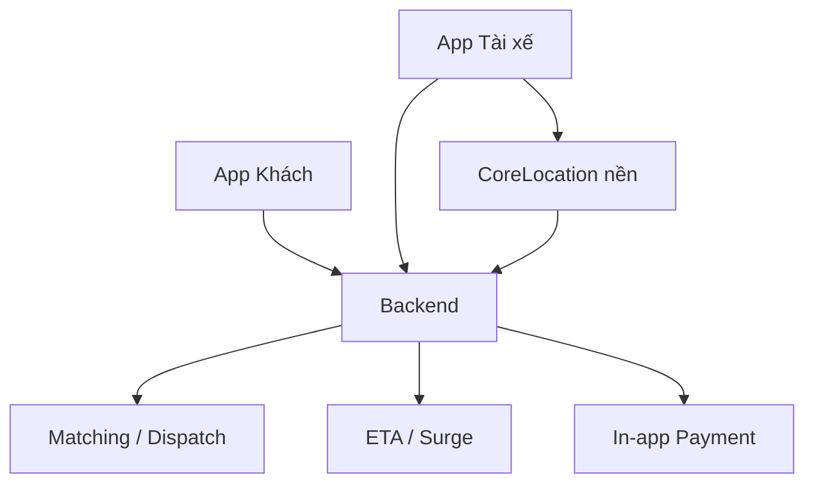
- **Bài học:** định vị nền vs pin là cân đối thường trực. Thanh khoản hai phía mới là vấn đề thật.

---

## Bài CS-12 — Music Streaming

### Slide 1 · Tổng quan
- **Lĩnh vực:** media.
- **Ý tưởng:** nghe nhạc, tải về nghe offline.
- **Mô hình:** subscription (phí Apple + bản quyền hãng đĩa = biên rất mỏng).
- **Yếu tố then chốt:** kinh tế **bản quyền** chi phối mô hình kinh doanh.

### Slide 2 · Khái niệm & thuật ngữ
- **Adaptive streaming (HLS):** đổi bitrate theo mạng.
- **FairPlay DRM:** bảo vệ tải offline.
- **Gapless playback:** phát liền mạch.
- **CarPlay / AirPlay:** bề mặt mở rộng tăng độ "dính".
- **Cache management:** quản lý bộ nhớ tải về lớn.

### Slide 3 · Kiến trúc & bài học
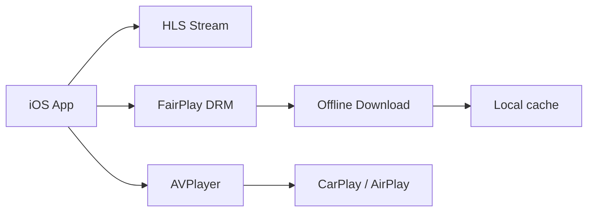
- **Bài học:** bản quyền quyết định kinh doanh. DRM + offline thực sự khó. CarPlay/Watch tăng độ gắn bó.

---

## Bài CS-13 — Dating

### Slide 1 · Tổng quan
- **Lĩnh vực:** mạng xã hội / hẹn hò.
- **Ý tưởng:** khám phá theo vị trí, quẹt để ghép cặp, chat.
- **Mô hình:** subscription theo bậc + microtransaction (boost, super-like).
- **Yếu tố then chốt:** **an toàn & chống tài khoản giả** là kỹ thuật cốt lõi.

### Slide 2 · Khái niệm & thuật ngữ
- **Matching algorithm:** thuật toán gợi ý.
- **Geolocation discovery:** khám phá theo khoảng cách.
- **Trust & Safety:** xác minh ảnh, kiểm duyệt, report/block.
- **Anti-fraud:** chống gian lận/bot.
- **Card-swipe performance:** mượt khi quẹt.

### Slide 3 · Kiến trúc & bài học
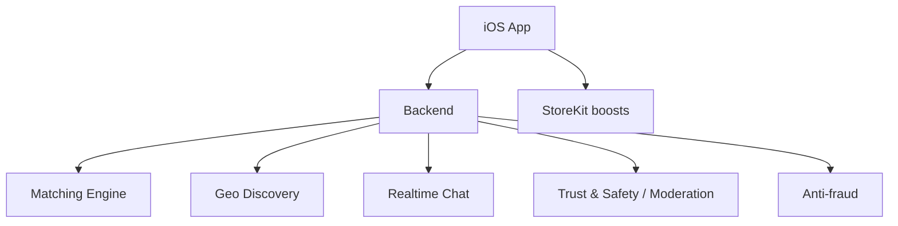
- **Bài học:** an toàn và phòng tài khoản giả là engineering lõi. Thiết kế microtransaction tạo phần lớn doanh thu.

---

## Bài CS-14 — News / Reading

### Slide 1 · Tổng quan
- **Lĩnh vực:** báo chí / xuất bản.
- **Ý tưởng:** đọc tin, lưu offline, nhận tin nóng.
- **Mô hình:** subscription + quảng cáo (lai).
- **Yếu tố then chốt:** kỷ luật **push** = giữ chân hay bị gỡ.

### Slide 2 · Khái niệm & thuật ngữ
- **Content pipeline (CMS):** dựng & phân phối nội dung.
- **Metered paywall:** giới hạn số bài miễn phí.
- **Reader app entitlement:** quy định subscription của Apple.
- **Rich text/media rendering:** dựng bài đa phương tiện.
- **Smart push:** tin nóng không spam.

### Slide 3 · Kiến trúc & bài học
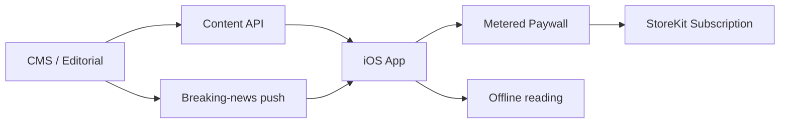
- **Bài học:** logic đo lượt đọc & luật subscription của Apple định hình kiến trúc. Push kỷ luật quyết định retention.

---

## Bài CS-15 — AR Furniture / Measuring

### Slide 1 · Tổng quan
- **Lĩnh vực:** AR commerce.
- **Ý tưởng:** đặt đồ nội thất ảo vào phòng thật, đo kích thước.
- **Mô hình:** lead-gen bán lẻ ("thử trước khi mua") dẫn về doanh số cửa hàng.
- **Yếu tố then chốt:** thường là **một tính năng** trong app bán lẻ, không phải mô hình kinh doanh độc lập.

### Slide 2 · Khái niệm & thuật ngữ
- **ARKit + RealityKit:** nền tảng AR.
- **Plane detection & occlusion:** nhận mặt phẳng, che khuất.
- **USDZ:** định dạng model 3D.
- **Lighting estimation:** ước lượng ánh sáng cho chân thực.
- **Device gating (LiDAR):** phân mảnh thiết bị.

### Slide 3 · Kiến trúc & bài học
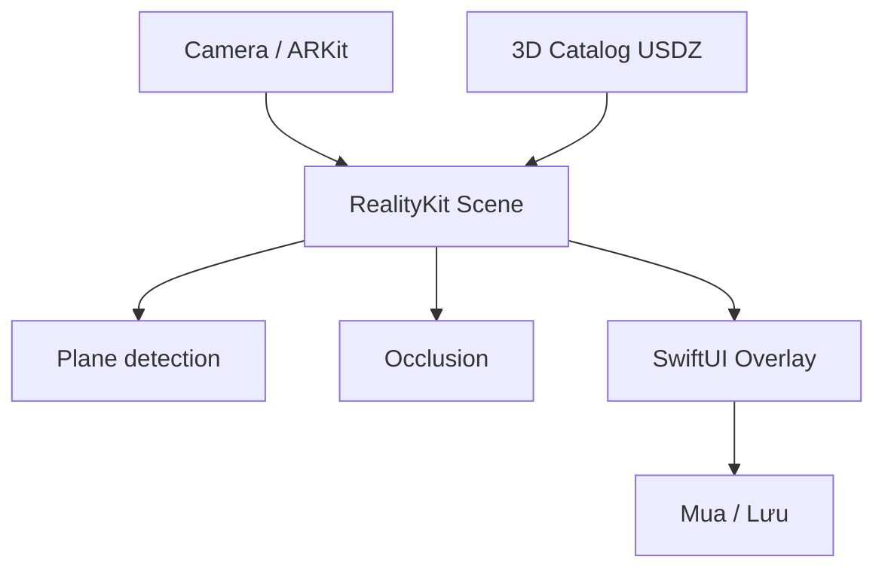
- **Bài học:** UX dạy người dùng quét phòng là tất cả — onboarding quyết định. Phân mảnh thiết bị (có/không LiDAR).

---

## Bài CS-16 — Smart-Home / Hardware Companion

### Slide 1 · Tổng quan
- **Lĩnh vực:** IoT.
- **Ý tưởng:** app điều khiển thiết bị phần cứng (đèn, khóa, cảm biến).
- **Mô hình:** app miễn phí; tiền nằm ở **phần cứng**; chất lượng app kéo review phần cứng.
- **Yếu tố then chốt:** app chạy theo **lịch của phần cứng**.

### Slide 2 · Khái niệm & thuật ngữ
- **CoreBluetooth (BLE):** ghép & giao tiếp thiết bị.
- **HomeKit:** tích hợp nhà thông minh Apple.
- **OTA firmware update:** cập nhật firmware qua app.
- **Reconnection handling:** xử lý kết nối chập chờn.
- **Background BLE constraints:** giới hạn nền của hệ thống.

### Slide 3 · Kiến trúc & bài học
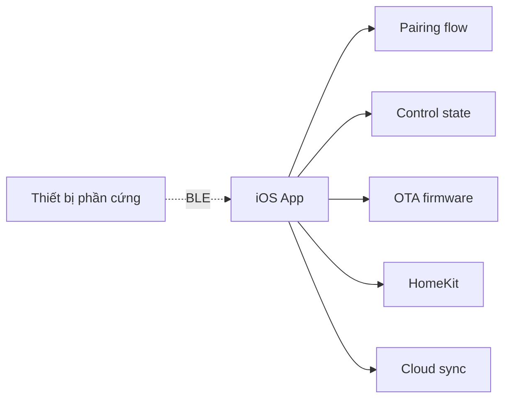
- **Bài học:** quản lý trạng thái BLE & tự kết nối lại rất nhọc và dễ lỗi. Khoảnh khắc **ghép thiết bị** quyết định thành bại.

---

## Bài CS-17 — Kids Education

### Slide 1 · Tổng quan
- **Lĩnh vực:** Kids EdTech.
- **Ý tưởng:** học mà chơi cho trẻ nhỏ, an toàn.
- **Mô hình:** family subscription — **cha mẹ mua, trẻ dùng**.
- **Yếu tố then chốt:** **tuân thủ pháp lý** ràng buộc mọi thứ.

### Slide 2 · Khái niệm & thuật ngữ
- **COPPA:** luật quyền riêng tư trẻ em — không quảng cáo hành vi, không tracker bên thứ ba.
- **Parental gate:** cổng (câu hỏi toán) trước khi mua/mở link.
- **Kids Category rules:** App Review nghiêm ngặt.
- **Offline content:** phần lớn chạy offline.
- **Dual UX:** giao diện cho cả phụ huynh & trẻ.

### Slide 3 · Kiến trúc & bài học
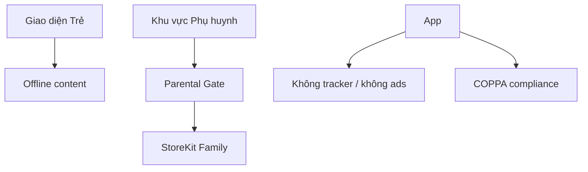
- **Bài học:** tuân thủ định hình mọi thứ (cấm tracker, cẩn trọng dữ liệu). App Review cho Kids Category rất khắt khe.

---

## Bài CS-18 — Enterprise Field App

### Slide 1 · Tổng quan
- **Lĩnh vực:** doanh nghiệp / B2B.
- **Ý tưởng:** kỹ thuật viên hiện trường nhập liệu, thường **không có sóng**.
- **Mô hình:** B2B SaaS — license theo seat, chu kỳ bán dài.
- **Yếu tố then chốt:** **người mua ≠ người dùng**; độ tin cậy > độ bóng bẩy.

### Slide 2 · Khái niệm & thuật ngữ
- **Offline-first capture:** nhập liệu khi mất mạng, đồng bộ sau.
- **MDM / Apple Business Manager:** phân phối nội bộ, không qua App Store.
- **SSO (ASWebAuthenticationSession):** đăng nhập doanh nghiệp.
- **Encryption & security:** mã hóa mạnh.
- **Legacy integration:** tích hợp hệ thống cũ chi phối khối lượng việc.

### Slide 3 · Kiến trúc & bài học
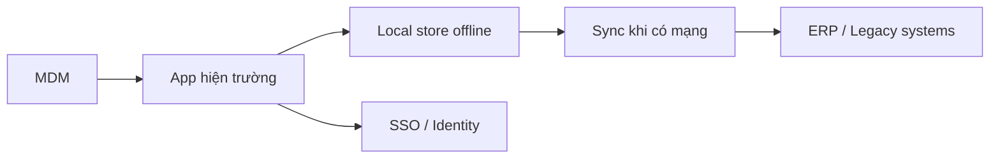
- **Bài học:** phân phối qua MDM, không qua Store công khai. Độ tin cậy > polish. Tích hợp hệ thống cũ chiếm phần lớn công sức.

---

## Bài CS-19 — Short-Video / Reels Editor

### Slide 1 · Tổng quan
- **Lĩnh vực:** creator economy.
- **Ý tưởng:** dựng video ngắn nhiều lớp, hiệu ứng, nhạc.
- **Mô hình:** creator subscription (hiệu ứng pro, không watermark, độ phân giải cao).
- **Yếu tố then chốt:** **độ tin cậy & tốc độ export** là thước đo niềm tin.

### Slide 2 · Khái niệm & thuật ngữ
- **AVFoundation composition:** timeline nhiều clip, trộn audio.
- **AVAssetExportSession:** pipeline xuất video tin cậy.
- **Metal effects:** hiệu ứng trên GPU.
- **Background export:** xuất khi app vào nền.
- **Thermal & memory:** video ngốn nhiệt và RAM.

### Slide 3 · Kiến trúc & bài học
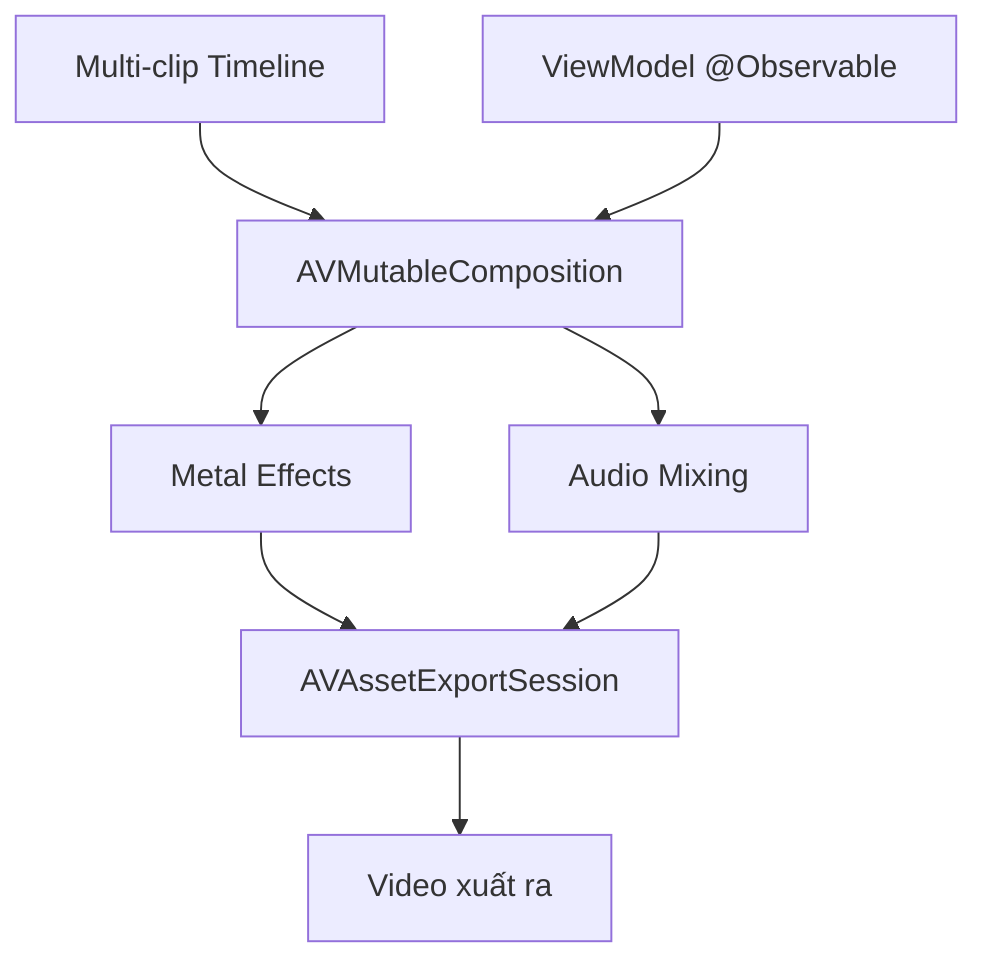
- **Bài học:** export ổn định & nhanh là thước đo niềm tin. Quản lý nhiệt và bộ nhớ. **Template** hạ rào kỹ năng, thúc đẩy chấp nhận.

---

## Bài CS-20 — AI Chat Assistant

### Slide 1 · Tổng quan
- **Lĩnh vực:** AI.
- **Ý tưởng:** trợ lý hội thoại trả lời theo ngữ cảnh.
- **Mô hình:** theo lượt dùng hoặc subscription — nhưng **chi phí token là giá vốn (COGS)**.
- **Yếu tố then chốt:** biên lợi nhuận = (giá − chi phí token) → **định tuyến model** là quyết định tài chính.

### Slide 2 · Khái niệm & thuật ngữ
- **LLM API + streaming (SSE):** token hiện dần, nâng cảm nhận chất lượng.
- **Token/cost management:** caching, chọn model rẻ cho lượt dễ.
- **Model routing:** rẻ ↔ mạnh tùy độ khó.
- **Conversation state:** giữ ngữ cảnh hội thoại.
- **Privacy:** dữ liệu nào rời thiết bị.

### Slide 3 · Kiến trúc & bài học
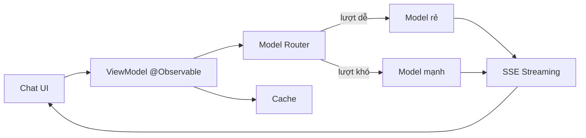
- **Bài học:** UX streaming là đòn bẩy cảm nhận chất lượng. Biên lợi nhuận = giá − chi phí token, nên **định tuyến model là quyết định tài chính**.

---

## Tổng kết — Bản đồ năng lực

20 bài này phủ, về **kỹ thuật**: on-device ML, audio, video, AR, BLE, location, HealthKit, CloudKit sync, payments, DRM, realtime backend, bảo mật & tuân thủ.

Về **kinh doanh**: subscription, freemium, quảng cáo, IAP, marketplace, giao dịch, B2B, phần cứng.

> Gợi ý dùng trong khóa học: chọn 4–6 bài làm "case study tuần", mỗi buổi mổ xẻ 1 app rồi cho học viên tự phác kiến trúc một app cùng lĩnh vực.
