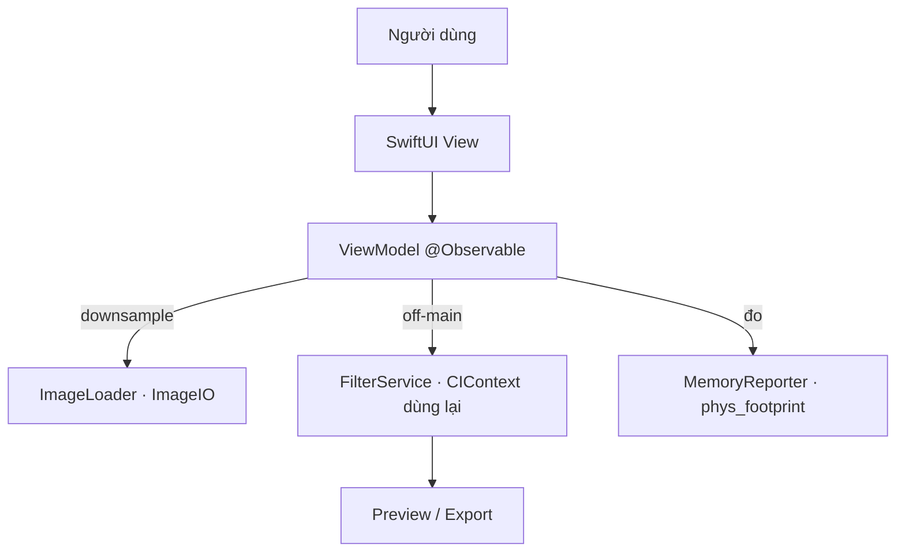

# CS-1 · AI Photo Editor — Tài liệu dự án

Tài liệu đi kèm dự án mẫu **PhotoEditorDemo** cho Case Study #1. Đây là bản
"mổ xẻ" sâu hơn [README](README.md): giải thích **từng file**, **tại sao viết như
vậy**, và **bài học hiệu năng** rút ra — để dùng làm giáo trình trên lớp.

- **Lĩnh vực:** công cụ chỉnh ảnh AI (kiểu SnapEdit).
- **Trọng tâm dạy học:** cạm bẫy **bộ nhớ · hang · CPU** khi xử lý ảnh độ phân giải cao.
- **Chạy:** hoàn toàn on-device, không server/API key/tài khoản, chạy trên Simulator.
- **Yêu cầu:** Xcode 16+, iOS 17.0+.

---

## 1. Bức tranh tổng thể

Một app chỉnh ảnh thật phải xử lý ảnh từ camera **12–48MP**. Sai lầm phổ biến là
"nạp ảnh → vẽ lên màn hình → áp filter" một cách ngây thơ. Với ảnh 48MP:

```
48,000,000 pixel × 4 byte/pixel (RGBA) ≈ 190 MB  ← chỉ riêng MỘT bitmap
```

Giữ vài bitmap như vậy + filter trung gian → app vượt giới hạn RAM → **bị hệ điều
hành kill** (crash kiểu *Jetsam*, không có stack trace đẹp). Nếu lại xử lý trên
main thread → **UI đứng hình** (hang) vài giây.

Dự án này biến hai cạm bẫy đó thành thứ **nhìn thấy & đo được** trong tab *Memory Lab*.

---

## 2. Chạy thử nhanh

```bash
cd samples/cs-1-photo-editor
open PhotoEditorDemo.xcodeproj      # rồi ⌘R trên simulator bất kỳ
```

Hoặc:

```bash
xcodebuild -scheme PhotoEditorDemo \
  -destination 'platform=iOS Simulator,name=iPhone 17 Pro' build
```

**Kịch bản demo trên lớp (2 phút):**
1. Tab **Memory Lab** → kéo trượt **48 MP** → **Tạo ảnh nguồn**.
2. Bấm **❌ Cách sai** → vừa bấm vừa thử kéo màn hình: **đứng hình**, kết quả `+~190 MB`.
3. Bấm **✅ Cách đúng** → mượt, kết quả `+~vài MB`.
4. Chỉ vào hai dòng kết quả: cùng một ảnh, khác nhau ở *cách nạp & nơi chạy*.

---

## 3. Kiến trúc

MVVM chuẩn nhà trường: **SwiftUI · `@Observable` · async/await · service tách protocol.**

```
PhotoEditorDemo/
├── App/
│   ├── PhotoEditorDemoApp.swift     @main entry
│   └── RootView.swift               TabView: Chỉnh ảnh · Memory Lab · Bài học
├── Core/
│   ├── Memory/
│   │   └── MemoryReporter.swift     đọc phys_footprint (như thước đo Xcode)
│   └── ImageIO/
│       ├── ImageLoader.swift        downsample qua ImageIO (chìa khóa)
│       └── SyntheticImage.swift     tạo ảnh nặng để demo (không kèm file ảnh)
├── Features/
│   ├── Editor/
│   │   ├── EditorView.swift         UI chọn ảnh + filter + share
│   │   ├── EditorModel.swift        @Observable view model
│   │   └── FilterService.swift      Core Image, dùng lại 1 CIContext
│   ├── MemoryLab/
│   │   ├── MemoryLabView.swift      UI so sánh sai/đúng
│   │   └── MemoryLabModel.swift     đo bộ nhớ & thời gian
│   └── About/
│       └── AboutView.swift          tóm tắt bài học
└── Resources/
    └── Assets.xcassets              AppIcon + AccentColor
```



> **Synchronized folders (Xcode 16+):** target tham chiếu *thư mục*, không liệt kê
> từng file trong `.pbxproj`. Thêm file `.swift` vào thư mục là Xcode tự nhận —
> `.pbxproj` không bị "war" khi nhiều người cùng sửa.

---

## 4. Đi qua từng file

### `Core/Memory/MemoryReporter.swift`
Đọc **physical footprint** của tiến trình qua `task_info(TASK_VM_INFO)` →
`phys_footprint`. Đây đúng là con số thước đo bộ nhớ của Xcode dùng, nên số liệu
trong app *khớp* với Instruments — đáng tin để dạy.

```swift
var info = task_vm_info_data_t()
var count = mach_msg_type_number_t(
    MemoryLayout<task_vm_info_data_t>.size / MemoryLayout<integer_t>.size)
task_info(mach_task_self_, task_flavor_t(TASK_VM_INFO), /* … */)
return info.phys_footprint
```

### `Core/ImageIO/ImageLoader.swift` — **trái tim của bài học**
Tạo thumbnail **đúng kích thước cần** bằng ImageIO, không bao giờ bung bitmap full-res:

```swift
let options: [CFString: Any] = [
    kCGImageSourceCreateThumbnailFromImageAlways: true,
    kCGImageSourceCreateThumbnailWithTransform: true,   // tôn trọng EXIF
    kCGImageSourceShouldCacheImmediately: true,         // giải mã ngay (off-main)
    kCGImageSourceThumbnailMaxPixelSize: maxPixel
]
CGImageSourceCreateThumbnailAtIndex(source, 0, options as CFDictionary)
```

So với `UIImage(data:)`: `UIImage` chỉ giữ data nén, nhưng **khi vẽ** sẽ bung bitmap
full-res. `downsample` cắt vấn đề từ gốc — RAM chỉ đủ cho ảnh nhỏ.

### `Core/ImageIO/SyntheticImage.swift`
Tạo ảnh gradient nhiều màu + chi tiết tần số cao ở số megapixel tùy chọn, encode
JPEG **trong RAM**. Nhờ vậy repo không kèm ảnh nặng, và simulator chưa có ảnh nào
vẫn demo được. `pixelSize(megapixels:)` quy đổi MP → kích thước pixel (khung 3:4).

### `Features/Editor/FilterService.swift`
Áp filter Core Image. Điểm hiệu năng: **dùng lại MỘT `CIContext`**.

```swift
private let context = CIContext(options: [.useSoftwareRenderer: false])
```

Tạo `CIContext` mỗi khung hình là lỗi kinh điển: mỗi context biên dịch lại pipeline
Metal → giật và ngốn RAM. Service tách sau `protocol FilterServing` để view model
test/độc lập được.

### `Features/Editor/EditorModel.swift`
`@MainActor @Observable`. Quy tắc: **downsample ngay khi nạp** (`previewMaxPixel =
1600`) và **mọi xử lý chạy `Task.detached`** (ngoài main thread):

```swift
let downsized = await Task.detached(priority: .userInitiated) {
    ImageLoader.downsample(data: data, maxPixel: maxPixel)
}.value
```

Đổi filter qua `didSet` → `reapplyFilter()` cũng chạy off-main → UI không giật.

### `Features/MemoryLab/MemoryLabModel.swift` — **demo sai vs đúng**

**❌ `runNaive()`** — cố tình chạy **đồng bộ trên main thread**, bung bitmap full-res:

```swift
let renderer = UIGraphicsImageRenderer(size: image.size, format: format)
let fullRes = renderer.image { _ in image.draw(at: .zero) }   // ~190 MB cho 48MP
let filtered = service.apply(.vivid, to: fullRes)
peak = MemoryReporter.footprint()                              // đo khi bitmap còn sống
```

→ UI đứng hình (chính là bài học), footprint nhảy vọt.

**✅ `runOptimized()`** — downsample + `Task.detached`, kèm *poller* trên main actor
để vừa lấy đỉnh footprint vừa **chứng minh main thread còn rảnh**:

```swift
let poller = Task { @MainActor in
    while !Task.isCancelled {
        peak = max(peak, MemoryReporter.footprint())
        try? await Task.sleep(for: .milliseconds(8))
    }
}
let output = await Task.detached(priority: .userInitiated) {
    let preview = ImageLoader.downsample(data: data, maxPixel: 1600)
    return preview.flatMap { service.apply(.vivid, to: $0) }
}.value
poller.cancel()
```

Poller tick được trong lúc xử lý ⇒ main thread không bị block. Đó là sự khác biệt
*nhìn thấy được* so với `runNaive`.

### `Features/.../*View.swift`
SwiftUI thuần, `@State private var model = …`, không logic nặng trong view. `RootView`
là `TabView` ba tab. `EditorView` có `PhotosPicker` + `ShareLink` (export chạy trên
simulator).

---

## 5. Bốn bài học (bản đồ → code)

| # | Bài học | Vì sao | File |
|---|---|---|---|
| 1 | **Downsample khi nạp** | Ảnh 48MP ≈ 190 MB/bitmap → vượt RAM → bị kill | `ImageLoader.swift` |
| 2 | **Xử lý ngoài main thread** | Filter nặng trên main = hang vài giây | `Task.detached` trong các Model |
| 3 | **Dùng lại `CIContext`** | Context mới mỗi frame = biên dịch lại Metal, giật | `FilterService.swift` |
| 4 | **Full-res chỉ khi export** | Preview thấp res; full-res (nên tile) chỉ ở bước cuối | `previewMaxPixel` |

Quy tắc rút gọn: **"Downsample sớm, xử lý nền, đo bằng số thật."**

---

## 6. Bài tập mở rộng

1. **Tiled export:** xuất full-res bằng cách chia ô (tile) thay vì downsample — giữ
   RAM thấp mà vẫn ra ảnh chất lượng cao.
2. **Xóa nền (Vision):** thêm `VNGeneratePersonSegmentationRequest` → tách người/nền.
3. **Đo CPU/nhiệt:** thêm cảnh báo `ProcessInfo.thermalState` khi xử lý liên tục.
4. **StoreKit 2:** thêm paywall + watermark cho bản free như slide CS-1.
5. **Cache:** nhớ kết quả filter theo (ảnh, filter) để khỏi xử lý lại.

---

## 7. Tham chiếu nhanh

- Đọc footprint: `MemoryReporter.footprint()` → so khớp với Instruments › Allocations.
- Ngưỡng an toàn: ưu tiên giữ đỉnh footprint thấp hơn nhiều "Memory Limit" của thiết bị
  (thiết bị thấp ~ vài trăm MB cho app nền trước).
- Tài liệu Apple: *Image I/O*, *Core Image Programming Guide*, WWDC "Image and
  Graphics Best Practices".
