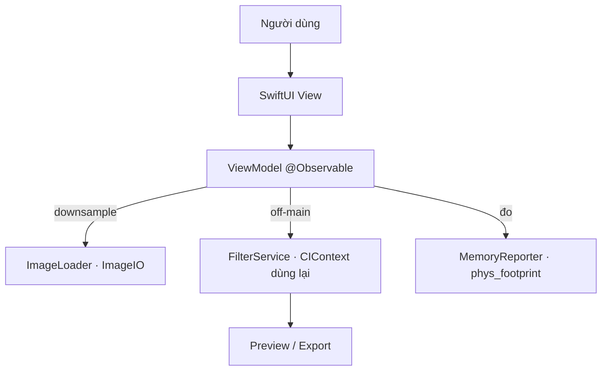
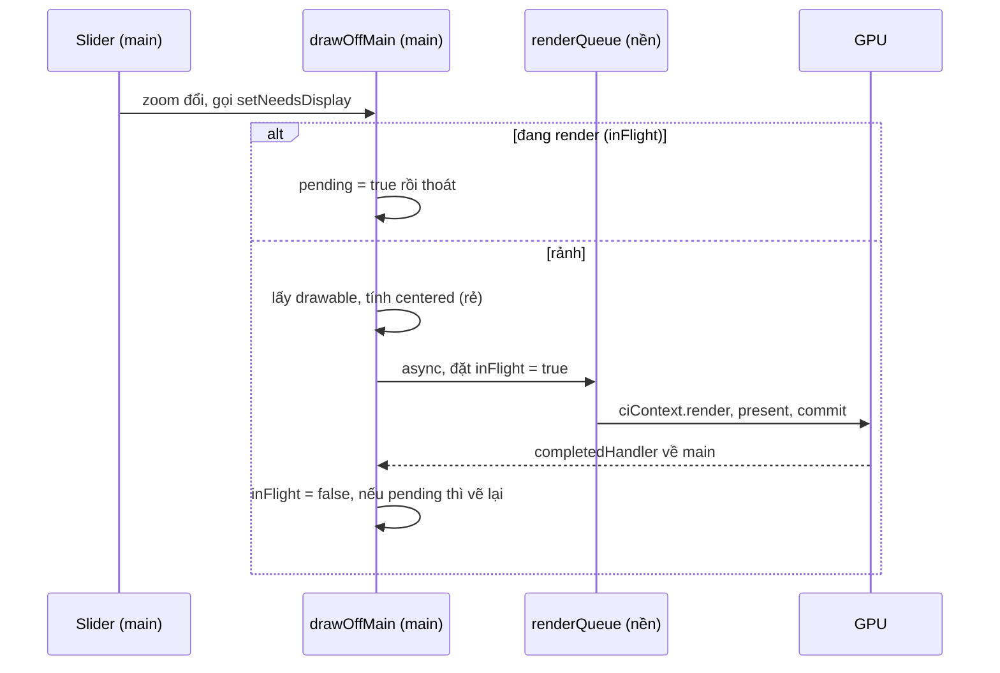

# CS-1 · AI Photo Editor — Tài liệu dự án

Tài liệu đi kèm dự án mẫu **PhotoEditorDemo** cho Case Study #1. Đây là bản
"mổ xẻ" sâu hơn [README](README.md): giải thích **từng file**, **tại sao viết như
vậy**, và **bài học hiệu năng** rút ra — để dùng làm giáo trình trên lớp.

- **Lĩnh vực:** công cụ chỉnh ảnh AI (kiểu SnapEdit).
- **Trọng tâm dạy học:** cạm bẫy **bộ nhớ · hang · CPU** khi xử lý ảnh độ phân giải cao.
- **Chạy:** hoàn toàn on-device, không server/API key/tài khoản, chạy trên Simulator.
- **Yêu cầu:** Xcode 16+, iOS 17.0+.

---

## 1. Bức tranh tổng thể

Một app chỉnh ảnh thật phải xử lý ảnh từ camera **12–48MP**. Sai lầm phổ biến là
"nạp ảnh → vẽ lên màn hình → áp filter" một cách ngây thơ. Với ảnh 48MP:

```
48,000,000 pixel × 4 byte/pixel (RGBA) ≈ 190 MB  ← chỉ riêng MỘT bitmap
```

Giữ vài bitmap như vậy + filter trung gian → app vượt giới hạn RAM → **bị hệ điều
hành kill** (crash kiểu *Jetsam*, không có stack trace đẹp). Nếu lại xử lý trên
main thread → **UI đứng hình** (hang) vài giây.

Dự án này biến hai cạm bẫy đó thành thứ **nhìn thấy & đo được** trong tab *Memory Lab*,
rồi đưa ra **hai cách làm đúng** để giữ footprint thấp:

| Cách xử lý ảnh 48MP | Footprint | Xem ảnh | Tab |
|---|---|---|---|
| ❌ Full-res bitmap trên main thread | ~190 MB + **hang** | đầy đủ | Memory Lab |
| ✅ **Cách 1** — Downsample (ImageIO, CPU) | ~vài MB | bản thu nhỏ | Memory Lab · Chỉnh ảnh |
| ✅ **Cách 2** — Render GPU (`MTKView` + `CIContext`) | ~40–60 MB | **đầy đủ**, zoom/pan được | Metal |

---

## 1b. Khái niệm cốt lõi (cho người mới)

Bốn ý tưởng chi phối mọi tinh chỉnh hiệu năng trong sample này:

1. **Ảnh ≠ file ảnh.** Một file JPEG 10 MB khi *vẽ ra màn hình* sẽ bung thành bitmap
   `rộng × cao × 4` byte. Ảnh 50MP ≈ **200 MB RAM**. → *Đừng bao giờ giữ bitmap
   full-res nếu không thật cần.*
2. **Main thread là luồng vẽ UI.** Mọi việc nặng (giải mã ảnh, filter, render) chạy ở
   đây sẽ làm **app đứng hình** (hang). → *Đẩy việc nặng sang luồng nền.*
3. **Tài nguyên đắt thì tạo một lần.** `CIContext` biên dịch cả pipeline Metal, rất
   tốn. → *Dùng lại, đừng tạo mỗi khung hình.*
4. **Chỉ trả giá khi thật cần.** Màn hình chỉ ~1–3 triệu pixel; ảnh 50MP là thừa thãi.
   → *Làm việc ở độ phân giải hiển thị (LOD); full-res chỉ khi export hoặc zoom sâu.*

Sample cho bạn **nhìn thấy & đo** cả 4 điều này ở tab *Memory Lab*, và **2 cách áp
dụng đúng**: tab *Chỉnh ảnh* (CPU downsample) và tab *Metal* (GPU + LOD + đa luồng).

---

## 2. Chạy thử nhanh

```bash
cd samples/cs-1-photo-editor
open PhotoEditorDemo.xcodeproj      # rồi ⌘R trên simulator bất kỳ
```

Hoặc:

```bash
xcodebuild -scheme PhotoEditorDemo \
  -destination 'platform=iOS Simulator,name=iPhone 17 Pro' build
```

**Kịch bản demo trên lớp (2 phút):**
1. Tab **Memory Lab** → kéo trượt **48 MP** → **Tạo ảnh nguồn**.
2. Bấm **❌ Cách sai** → vừa bấm vừa thử kéo màn hình: **đứng hình**, kết quả `+~190 MB`.
3. Bấm **✅ Cách đúng** → mượt, kết quả `+~vài MB`.
4. Chỉ vào hai dòng kết quả: cùng một ảnh, khác nhau ở *cách nạp & nơi chạy*.
5. Sang tab **Metal** → **Ảnh test** → chọn ảnh **51MP** → kéo zoom: chi tiết thật
   hiện ra mà dòng *Footprint* vẫn chỉ ~**40–60 MB**.

---

## 3. Kiến trúc

MVVM chuẩn nhà trường: **SwiftUI · `@Observable` · async/await · service tách protocol.**

```
PhotoEditorDemo/
├── App/
│   ├── PhotoEditorDemoApp.swift     @main entry
│   └── RootView.swift               TabView: Chỉnh ảnh · Memory Lab · Metal · Bài học
├── Core/
│   ├── Memory/
│   │   └── MemoryReporter.swift     đọc phys_footprint (như thước đo Xcode)
│   ├── ImageIO/
│   │   ├── ImageLoader.swift        downsample qua ImageIO — CÁCH 1
│   │   └── SyntheticImage.swift     tạo ảnh nặng cho Memory Lab (không kèm file)
│   ├── Metal/
│   │   └── MetalImageView.swift     MTKView + CIContext + LOD — CÁCH 2
│   └── TestImages/
│       └── TestImageStore.swift     tìm & mô tả ảnh test trong bundle (ImageIO)
├── Features/
│   ├── Editor/
│   │   ├── EditorView.swift         UI chọn ảnh + filter + share
│   │   ├── EditorModel.swift        @Observable view model
│   │   └── FilterService.swift      Core Image, dùng lại 1 CIContext
│   ├── MemoryLab/
│   │   ├── MemoryLabView.swift      UI so sánh sai/đúng
│   │   └── MemoryLabModel.swift     đo bộ nhớ & thời gian (ảnh synthetic)
│   ├── MetalPreview/
│   │   ├── MetalPreviewView.swift   canvas Metal: zoom/pan, nạp ảnh test
│   │   └── MetalPreviewModel.swift  LOD: displayImage + fullImage (lazy)
│   ├── Shared/
│   │   ├── FilterBar.swift          thanh filter dùng chung
│   │   └── TestImagePickerSheet.swift  chọn ảnh test (dùng chung)
│   └── About/
│       └── AboutView.swift          tóm tắt bài học + khi nào ImageIO vs Metal
└── Resources/
    ├── Assets.xcassets             AppIcon + AccentColor
    └── TestImages/                 ảnh thật .jpg đóng gói sẵn (17–51 MP)
```



> **Synchronized folders (Xcode 16+):** target tham chiếu *thư mục*, không liệt kê
> từng file trong `.pbxproj`. Thêm file `.swift` vào thư mục là Xcode tự nhận —
> `.pbxproj` không bị "war" khi nhiều người cùng sửa.

---

## 4. Đi qua từng file

### `Core/Memory/MemoryReporter.swift`
Đọc **physical footprint** của tiến trình qua `task_info(TASK_VM_INFO)` →
`phys_footprint`. Đây đúng là con số thước đo bộ nhớ của Xcode dùng, nên số liệu
trong app *khớp* với Instruments — đáng tin để dạy.

```swift
var info = task_vm_info_data_t()
var count = mach_msg_type_number_t(
    MemoryLayout<task_vm_info_data_t>.size / MemoryLayout<integer_t>.size)
task_info(mach_task_self_, task_flavor_t(TASK_VM_INFO), /* … */)
return info.phys_footprint
```

### `Core/ImageIO/ImageLoader.swift` — **trái tim của bài học**
Tạo thumbnail **đúng kích thước cần** bằng ImageIO, không bao giờ bung bitmap full-res:

```swift
let options: [CFString: Any] = [
    kCGImageSourceCreateThumbnailFromImageAlways: true,
    kCGImageSourceCreateThumbnailWithTransform: true,   // tôn trọng EXIF
    kCGImageSourceShouldCacheImmediately: true,         // giải mã ngay (off-main)
    kCGImageSourceThumbnailMaxPixelSize: maxPixel
]
CGImageSourceCreateThumbnailAtIndex(source, 0, options as CFDictionary)
```

So với `UIImage(data:)`: `UIImage` chỉ giữ data nén, nhưng **khi vẽ** sẽ bung bitmap
full-res. `downsample` cắt vấn đề từ gốc — RAM chỉ đủ cho ảnh nhỏ.

### `Core/ImageIO/SyntheticImage.swift`
Tạo ảnh gradient nhiều màu + chi tiết tần số cao ở số megapixel tùy chọn, encode
JPEG **trong RAM**. Nhờ vậy repo không kèm ảnh nặng, và simulator chưa có ảnh nào
vẫn demo được. `pixelSize(megapixels:)` quy đổi MP → kích thước pixel (khung 3:4).

### `Features/Editor/FilterService.swift`
Áp filter Core Image. Điểm hiệu năng: **dùng lại MỘT `CIContext`**.

```swift
private let context = CIContext(options: [.useSoftwareRenderer: false])
```

Tạo `CIContext` mỗi khung hình là lỗi kinh điển: mỗi context biên dịch lại pipeline
Metal → giật và ngốn RAM. Service tách sau `protocol FilterServing` để view model
test/độc lập được.

### `Features/Editor/EditorModel.swift`
`@MainActor @Observable`. Quy tắc: **downsample ngay khi nạp** (`previewMaxPixel =
1600`) và **mọi xử lý chạy `Task.detached`** (ngoài main thread):

```swift
let downsized = await Task.detached(priority: .userInitiated) {
    ImageLoader.downsample(data: data, maxPixel: maxPixel)
}.value
```

Đổi filter qua `didSet` → `reapplyFilter()` cũng chạy off-main → UI không giật.

### `Features/MemoryLab/MemoryLabModel.swift` — **demo sai vs đúng**

**❌ `runNaive()`** — cố tình chạy **đồng bộ trên main thread**, bung bitmap full-res:

```swift
let renderer = UIGraphicsImageRenderer(size: image.size, format: format)
let fullRes = renderer.image { _ in image.draw(at: .zero) }   // ~190 MB cho 48MP
let filtered = service.apply(.vivid, to: fullRes)
peak = MemoryReporter.footprint()                              // đo khi bitmap còn sống
```

→ UI đứng hình (chính là bài học), footprint nhảy vọt.

**✅ `runOptimized()`** — downsample + `Task.detached`, kèm *poller* trên main actor
để vừa lấy đỉnh footprint vừa **chứng minh main thread còn rảnh**:

```swift
let poller = Task { @MainActor in
    while !Task.isCancelled {
        peak = max(peak, MemoryReporter.footprint())
        try? await Task.sleep(for: .milliseconds(8))
    }
}
let output = await Task.detached(priority: .userInitiated) {
    let preview = ImageLoader.downsample(data: data, maxPixel: 1600)
    return preview.flatMap { service.apply(.vivid, to: $0) }
}.value
poller.cancel()
```

Poller tick được trong lúc xử lý ⇒ main thread không bị block. Đó là sự khác biệt
*nhìn thấy được* so với `runNaive`.

### `Core/Metal/MetalImageView.swift` — **tùy chọn 2: GPU + LOD + đa luồng**
`UIViewRepresentable` bọc `MTKView`; `Renderer` (MTKViewDelegate) dùng
`CIContext(mtlDevice:)` vẽ `CIImage` thẳng vào texture của drawable, **chỉ ở kích
thước đang hiển thị**:

```swift
ciContext.render(centered, to: drawable.texture, commandBuffer: commandBuffer,
                 bounds: CGRect(origin: .zero, size: dst), colorSpace: colorSpace)
```

Footprint thấp vì: `CIImage` là *công thức* lazy; Core Image render đúng kích thước
drawable và **tự tile** trên GPU; ta không bao giờ tạo `UIImage/CGImage` full-res.

**(a) Level-of-Detail — hai nguồn ảnh.** Render *cả khung* một ảnh 50MP ở zoom 1 vẫn
nặng (vùng cần xử lý = toàn ảnh). Nên view nhận 2 nguồn:
- `displayImage` — bản downsample ~2048px: dùng khi **zoom thấp** → render nhanh.
- `fullImage` — `CIImage` gốc lazy: chỉ dùng khi **zoom > ~2.5×**, lúc đó vùng nhìn
  thấy (ROI) chỉ là một mẩu nhỏ nên vẫn nhanh mà cho **chi tiết thật**.

**(b) Render ở đâu — tùy môi trường.** `MTKView` gọi `draw(in:)` trên **main thread**;
việc render nặng ở đó sẽ làm kéo zoom giật. Vì vậy:

```swift
#if targetEnvironment(simulator)
    drawOnMain(in: view)    // Simulator: Metal phần mềm không present được ngoài main
#else
    drawOffMain(in: view)   // Máy thật: đẩy render sang serial queue riêng
#endif
```

- **Máy thật:** `ciContext.render` chạy trên **serial queue** → main rảnh → kéo slider
  **mượt mà vẫn full-res**. Cờ `inFlight`/`pending` đảm bảo mỗi lúc chỉ một drawable,
  và **gộp** các giá trị zoom đến giữa chừng về giá trị mới nhất (pool chỉ có 3 drawable).
- **Simulator:** render trên main + lúc đang kéo thì dùng `displayImage` (`interactive`)
  cho khỏi lag.

> *Trạng thái repo hiện tại:* `draw(in:)` đang gọi thẳng `drawOffMain` (ưu tiên kiểm
> thử máy thật) ⇒ Simulator sẽ ra màn xám. Chi tiết & cách bật lại: xem **4b**.

Cài đặt: `framebufferOnly=false`, `isPaused=true`, `enableSetNeedsDisplay=true` (tự gọi
`setNeedsDisplay` để vẽ khi cần — không vẽ thừa). Filter áp dạng `CIImage → CIImage`
(xem `FilterService`) nên chạy trên GPU.

> **Đo thực tế:** ảnh test **51MP** (5832×8748) ở tab Metal → footprint ~**40–60 MB**
> ở *mọi* mức zoom, so với ~**190 MB** của cách bung full-res. Cùng một ảnh.

### `Core/TestImages/TestImageStore.swift` + `Features/Shared/TestImagePickerSheet.swift`
Tab *Chỉnh ảnh* và *Metal* nạp **ảnh thật đóng gói sẵn** (`Resources/TestImages`, 17–51
MP) để test. `TestImageStore` quét các `.jpg` trong bundle, đọc kích thước qua ImageIO
(**chỉ header, không giải mã**), và tạo thumbnail downsample cho picker — bản thân
picker cũng tuân thủ bài học "không bung full-res".

### `FilterService` có hai cửa
Sau refactor, service cung cấp:
- `apply(_:to: CIImage) -> CIImage` — công thức GPU thuần (dùng cho MTKView, vẫn lazy).
- `apply(_:to: UIImage) -> UIImage?` — render ra ảnh tĩnh (preview/export), gọi lại
  hàm trên rồi materialize qua `CIContext` dùng chung.

Đây là lý do cùng một bộ filter chạy được cho cả tab Chỉnh ảnh lẫn tab Metal mà
không lặp code.

### `Features/.../*View.swift`
SwiftUI thuần, `@State private var model = …`, không logic nặng trong view. `RootView`
là `TabView` bốn tab. `EditorView` có `PhotosPicker` + `ShareLink` (export chạy trên
simulator). `EditorView` và `MetalPreviewView` dùng chung `FilterBar`.

---

## 4b. Mổ xẻ sâu `MetalImageView`

Đây là file "khó" nhất sample — nơi gặp nhau của **SwiftUI ↔ UIKit ↔ Metal ↔ Core
Image** và toàn bộ kỹ thuật giữ-mượt. Đi từ trên xuống.

### Cầu nối: `UIViewRepresentable` + `Coordinator`
`MTKView` là view của UIKit, nên ta bọc nó cho SwiftUI bằng `UIViewRepresentable`.
- `makeUIView` tạo `MTKView` một lần.
- `makeCoordinator()` tạo `Renderer` — đây là **bộ não** (giữ trạng thái + vẽ), tồn
  tại xuyên suốt vòng đời view (SwiftUI không tạo lại mỗi lần body chạy lại).
- `updateUIView` được gọi **mỗi khi state SwiftUI đổi** → ta đồng bộ tham số xuống
  `Renderer`.

### `makeUIView` — ý nghĩa từng cờ `MTKView`
```swift
view.framebufferOnly = false      // cho phép CIContext GHI thẳng vào texture drawable
view.isPaused = true              // TẮT vòng lặp vẽ 60fps tự động…
view.enableSetNeedsDisplay = true // …chỉ vẽ khi ta gọi setNeedsDisplay()
context.coordinator.view = view   // Renderer giữ weak ref để tự yêu cầu vẽ lại
```
- `isPaused=true` + `enableSetNeedsDisplay=true` = **vẽ theo nhu cầu** (như
  `UIView.setNeedsDisplay`). Ảnh tĩnh thì không tốn GPU/pin; ta toàn quyền điều khiển
  *khi nào* vẽ — chìa khóa để không render thừa.
- `framebufferOnly=false` bắt buộc, vì Core Image cần ghi vào `drawable.texture`.

### `updateUIView` — "change-gate" chống render thừa
```swift
let changed = c.image !== image || c.zoom != zoom || …   // chỉ những thứ ảnh hưởng HÌNH
…copy tham số xuống coordinator…
if changed { view.setNeedsDisplay() }
```
SwiftUI gọi `updateUIView` *rất thường* (mỗi lần body tính lại — vd. footprint đổi).
Nếu cứ thế `setNeedsDisplay` thì ta vẽ lại ảnh full-res vô cớ → đúng cái bug treo máy
đã gặp. Nên ta **chỉ vẽ lại khi ảnh/filter/zoom/offset thật sự đổi**.
> Lưu ý nhỏ: `CIImage` là **class** → so sánh bằng `!==` (theo *tham chiếu*), không
> phải `!=`.

### `Renderer` — trạng thái & khởi tạo
```swift
ciContext = CIContext(mtlDevice: device, options: [.cacheIntermediates: false])
renderQueue = DispatchQueue(label: "…metalRender", qos: .userInteractive)
```
- Một `CIContext` GPU **dùng lại** cho cả view (đừng tạo mỗi frame). `cacheIntermediates:
  false` để không tích RAM.
- `renderQueue`: hàng đợi **nối tiếp** cho phần render nặng (đường máy thật).
- `inFlight` / `pending`: cờ điều phối — **chỉ chạm trên main thread** nên không cần khóa.

### `currentSource()` — chọn độ phân giải (LOD)
```swift
let useFull = zoom > fullResZoomThreshold        // 2.5×
return (useFull ? fullImage : displayImage) ?? fullImage ?? displayImage
```
Zoom thấp → `displayImage` (2048px, nhẹ). Zoom sâu → `fullImage` (gốc, lazy). Trên
simulator còn thêm điều kiện `!interactive` (đang kéo thì ép dùng display cho khỏi lag).

### `centeredImage(...)` — toán đặt ảnh (chưa render gì)
Trả về **một `CIImage` công thức** đã biến đổi để nằm đúng chỗ trong khung `dst`:
1. `baseScale` = aspect-fit (cạnh dài vừa khung) — giữ kích thước hiển thị **không đổi**
   dù nguồn là display hay full-res.
2. `× zoom`.
3. Canh giữa + cộng `offset` (đổi point→pixel bằng `contentScaleFactor`; **trừ** `dy`
   vì hệ toạ độ `CIImage` gốc ở **góc dưới-trái**, ngược trục Y với UIKit).

Bước này **rẻ** (chỉ là phép biến đổi lười) → chạy trên main vô tư; phần đắt là lúc
`ciContext.render` thật sự đọc pixel.

### Hai đường vẽ
`draw(in:)` (do `MTKView` gọi **trên main**) là *công tắc* chọn đường:

**`drawOnMain` (simulator):** render đồng bộ ngay trên main → present → commit. Đơn
giản, đáng tin trên Metal phần mềm, nhưng **khóa main** khi ảnh lớn ⇒ phải dựa vào LOD
proxy lúc kéo để khỏi giật.

**`drawOffMain` (máy thật):** giữ main rảnh, gồm 3 ý:
```swift
guard !inFlight else { pending = true; return }   // ① gộp: đang bận thì chỉ ghi nhận
…lấy drawable + tính centered TRÊN MAIN…           // ② currentDrawable phải lấy ở main
inFlight = true
renderQueue.async {                                // ③ phần NẶNG ra khỏi main
    ciContext.render(centered, to: drawable.texture, …)
    commandBuffer.addCompletedHandler { _ in
        DispatchQueue.main.async {                 // xong → mở khoá, render bước mới nhất
            inFlight = false
            if pending { pending = false; view.setNeedsDisplay() }
        }
    }
    commandBuffer.present(drawable); commandBuffer.commit()
}
```
- **① Gộp (coalesce):** kéo slider bắn ra hàng chục giá trị zoom/giây. Mỗi lúc chỉ cho
  **một** lần render chạy; các giá trị đến giữa chừng chỉ bật `pending`. Render xong thì
  vẽ lại **một lần** với giá trị mới nhất. Bắt buộc vì **pool chỉ có 3 drawable** — ôm
  nhiều drawable cùng lúc sẽ làm `currentDrawable` trả nil/treo.
- **② Lấy `currentDrawable` trên main** rồi mới đưa xuống queue: lấy ở thread nền không
  đáng tin.
- **③** `ciContext.render` (gồm cả giải mã JPEG vùng nhìn thấy) chạy ở `renderQueue` →
  main thread không bị khoá → **slider mượt mà vẫn full-res**.

### Vòng đời một lần kéo zoom (đường máy thật)


### Công tắc môi trường & trạng thái hiện tại
Thiết kế gốc gate bằng `#if targetEnvironment(simulator)` trong `draw(in:)`
(simulator → `drawOnMain`, máy thật → `drawOffMain`). **Hiện trong repo `draw(in:)`
đang gọi thẳng `drawOffMain`** (ưu tiên kiểm thử trên máy thật). Hệ quả: chạy trên
*Simulator* sẽ ra **màn xám** (Metal phần mềm không present được ngoài main). Mở lại
khối `#if` nếu muốn Simulator hiển thị (qua `drawOnMain`).

### Gotchas (đáng nhớ)
- `MTKViewDelegate.draw(in:)` luôn được gọi **trên main** — đó là lý do phải tự đẩy
  phần nặng đi nơi khác.
- `currentDrawable` lấy trên main; pool chỉ **3 cái** → đừng giữ nhiều.
- `present`-từ-thread-nền **không hiện trên Simulator** (chỉ máy thật).
- `CIImage` lazy: tạo/biến đổi đều rẻ; chi phí dồn vào `ciContext.render`.

---

## 5. Bốn bài học (bản đồ → code)

| # | Bài học | Vì sao | File |
|---|---|---|---|
| 1 | **Downsample khi nạp** | Ảnh 48MP ≈ 190 MB/bitmap → vượt RAM → bị kill | `ImageLoader.swift` |
| 2 | **Xử lý ngoài main thread** | Filter nặng trên main = hang vài giây | `Task.detached` trong các Model |
| 3 | **Dùng lại `CIContext`** | Context mới mỗi frame = biên dịch lại Metal, giật | `FilterService.swift` |
| 4 | **Full-res chỉ khi cần** | Preview ở độ phân giải hiển thị (LOD); full-res chỉ khi zoom sâu / export | `previewMaxPixel`, `MetalImageView` |
| 5 | **Render canvas mượt** | Việc nặng lúc đang kéo zoom phải ra khỏi main (queue riêng) hoặc dùng proxy; chỉ vẽ khi có thay đổi | `MetalImageView.swift` |

Quy tắc rút gọn: **"Downsample sớm, xử lý nền, vẽ đúng lúc, đo bằng số thật."**

---

## 5b. Dùng cách nào? `ImageIO` vs `MetalView`

Cả hai đều giữ footprint thấp, nhưng giải hai bài toán khác nhau:

| | **ImageIO** (`ImageLoader`) | **MetalView** (`MetalImageView`) |
|---|---|---|
| Bản chất | Thu nhỏ MỘT lần → `UIImage` nhỏ | Giữ công thức lazy, vẽ phần nhìn thấy mỗi frame |
| Chạy ở | CPU | GPU (Core Image tile) |
| Độ phân giải | **Mất** chi tiết gốc | **Giữ** full-res |
| Zoom thấy chi tiết thật | ❌ | ✅ (footprint nhích theo *vùng nhìn thấy*) |
| Filter realtime khi pan/zoom | Phải xử lý lại (CPU) | Rẻ — công thức GPU vẽ lại |
| Share / lưu / đưa vào `Image()` | ✅ có sẵn `UIImage` | ❌ cần render thêm một lần ra file |
| Độ phức tạp | Thấp | Cao hơn |

**Dùng `ImageIO` khi:** cần một ảnh **tĩnh** để hiển thị/chia sẻ/lưu, làm thumbnail
hoặc lưới ảnh — không cần soi chi tiết gốc. (Tab *Chỉnh ảnh*.)

**Dùng `MetalView` khi:** cần **canvas tương tác** — zoom/pan thấy chi tiết full-res
+ filter realtime mà vẫn ít RAM. (Tab *Metal*, đã có pinch · kéo · slider · chạm 2 lần
để reset.)

**Quy tắc thực chiến:** editor thật dùng **cả hai** — `MetalView` cho canvas khi
chỉnh, rồi **một lần** `CIContext.render` full-res ra file ở bước **export**.

> Lưu ý: `MetalView` không "miễn phí" — render **cả khung** một ảnh 50MP ở zoom 1
> rất nặng (ROI = toàn ảnh). Sample xử lý bằng **3 lớp**:
> 1. **LOD:** zoom thấp dùng bản display 2048px; zoom sâu (> ~2.5×) mới dùng full-res
>    (ROI nhỏ → vẫn nhanh, cho chi tiết thật).
> 2. **Đa luồng (máy thật):** đẩy `ciContext.render` sang serial queue, gộp về zoom
>    mới nhất → kéo slider mượt mà vẫn full-res. *(Simulator: render trên main + dùng
>    proxy lúc kéo, vì Metal phần mềm không present được ngoài main.)*
> 3. **Vẽ đúng lúc:** chỉ `setNeedsDisplay` khi ảnh/filter/zoom/offset đổi thật; đọc
>    footprint theo sự kiện, không poll.
>
> Footprint vẫn ~40–60 MB ở mọi mức zoom.
>
> **Bẫy đã gặp & sửa trong sample (đáng để dạy):**
> - Vòng poll footprint 0.5s ép `MTKView` render full-res *liên tục trên main* → treo
>   máy, CPU 100%. → bỏ poll, dùng sự kiện + chỉ vẽ khi đổi.
> - Kéo slider giật do mỗi bước zoom render lại trên main. → đẩy render ra queue riêng
>   (máy thật) / dùng proxy (simulator).

---

## 6. Bài tập mở rộng

1. **Tiled export:** xuất full-res bằng cách chia ô (tile) thay vì downsample — giữ
   RAM thấp mà vẫn ra ảnh chất lượng cao.
2. **Xóa nền (Vision):** thêm `VNGeneratePersonSegmentationRequest` → tách người/nền.
3. **Đo CPU/nhiệt độ:** thêm cảnh báo `ProcessInfo.thermalState` khi xử lý liên tục.
4. **StoreKit 2:** thêm paywall + watermark cho bản free như slide CS-1.
5. **Cache:** nhớ kết quả filter theo (ảnh, filter) để khỏi xử lý lại.

---

## 7. Tham chiếu nhanh

- Đọc footprint: `MemoryReporter.footprint()` → so khớp với Instruments › Allocations.
- Ngưỡng an toàn: ưu tiên giữ đỉnh footprint thấp hơn nhiều "Memory Limit" của thiết bị
  (thiết bị thấp ~ vài trăm MB cho app nền trước).
- Tài liệu Apple: *Image I/O*, *Core Image Programming Guide*, WWDC "Image and
  Graphics Best Practices".
